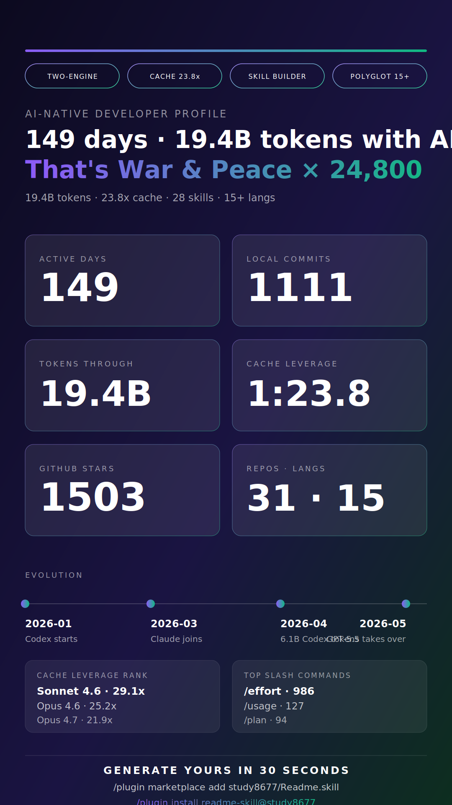

# Readme.skill

> A **skill** for Claude Code / Codex CLI: auto-generate a shareable, redacted **AI-Native Developer README**.

🌐 [中文版 README](./README.md) · **English** (you are here)

> 🎉 **2026-05-08**: Featured in [Ruan Yifeng's *Weekly for Tech Lovers* #395](https://www.ruanyifeng.com/blog/2026/05/weekly-issue-395.html) under "AI Related" — one of the most widely-read independent tech newsletters in the Chinese developer community. Thank you, Ruan! 🙏

<p align="center">
  <a href="./examples/profile_20260515_en.md">
    
  </a>
</p>

<p align="center">
  <em>↑ This is a real run on the author's own machine (149 days · 19.4B tokens · 23.8× cache leverage · 1503★).</em><br/>
  <em>Click the image for the full <a href="./examples/profile_20260515_en.md">Markdown profile</a>.</em>
</p>

## What is this

Readme.skill is not a program — it's an instruction set for an AI agent (i.e. [`SKILL.md`](./skills/readme-skill/SKILL.md)). When you say a trigger phrase in Claude Code or Codex (e.g. "build my AI usage profile"), the AI follows the SKILL.md recipe:

1. Read your local `~/.claude/`, project `.claude/plans` when configured, and `~/.codex/` stats files, SQLite, history JSONL
2. Call `gh` to pull your GitHub public contribution calendar and top repos
3. Run read-only `git log` in your working directories to count local commits
4. Compute 10 dimensions (overview / AI-Native / collaboration style / projects / topics / rhythm / output × input / velocity / evolution / token economics)
5. Anonymize and redact by default; write in the requested language to `output/profile_YYYYMMDD.md` or `output/profile_YYYYMMDD_en.md`

The whole flow is **read-only and fully local (except `gh`)** — safe to run, safe to share. Conversation text may be read for keyword and collaboration-style signal, but never copied verbatim into the report.

## Quick start

### Option 0: Claude Code Plugin (recommended — two commands)

Inside Claude Code:

```
/plugin marketplace add study8677/Readme.skill
/plugin install readme-skill@study8677
```

Claude Code auto-discovers `skills/readme-skill/SKILL.md` and mounts it — no manual symlinking. Requires a Claude Code build with the plugin subsystem.

### Option 1: Clone + symlink (Codex CLI users, or those skipping plugins)

```bash
git clone https://github.com/study8677/Readme.skill.git
cd Readme.skill

# Claude Code
mkdir -p ~/.claude/skills/readme-skill
ln -sf "$(pwd)/skills/readme-skill/SKILL.md" ~/.claude/skills/readme-skill/SKILL.md

# Codex CLI
mkdir -p ~/.codex/skills/readme-skill
ln -sf "$(pwd)/skills/readme-skill/SKILL.md" ~/.codex/skills/readme-skill/SKILL.md
```

### Option 2: Direct copy

```bash
git clone https://github.com/study8677/Readme.skill.git

# Claude Code
mkdir -p ~/.claude/skills/readme-skill
cp Readme.skill/skills/readme-skill/SKILL.md ~/.claude/skills/readme-skill/

# Codex CLI
mkdir -p ~/.codex/skills/readme-skill
cp Readme.skill/skills/readme-skill/SKILL.md ~/.codex/skills/readme-skill/
```

### Option 3: One-line curl

```bash
# Claude Code
mkdir -p ~/.claude/skills/readme-skill && curl -fsSL https://raw.githubusercontent.com/study8677/Readme.skill/main/skills/readme-skill/SKILL.md -o ~/.claude/skills/readme-skill/SKILL.md

# Codex CLI
mkdir -p ~/.codex/skills/readme-skill && curl -fsSL https://raw.githubusercontent.com/study8677/Readme.skill/main/skills/readme-skill/SKILL.md -o ~/.codex/skills/readme-skill/SKILL.md
```

## Use it

After installing, say one of these in Claude Code or Codex:

- "build my AI usage profile"
- "summarize my Claude / Codex history"
- "make me an AI-native README"
- "generate my AI profile" / "生成我的 AI 档案"
- "analyze my Claude usage"

The AI runs the full pipeline and writes to `output/profile_<date>_en.md` for English requests, or `output/profile_<date>.md` for Chinese/default requests.

### Private vs shareable

- **Default (shareable)** — project names anonymized to "Project A/B/C", private repos become "Private Repo X"
- **Private** — say "private version / show real names / 私人版", and the AI keeps real names (still scrubs API keys / emails)

## What the output looks like

Two artifacts:
1. **Markdown profile** — long-form narrative report, 10 dimensions; see [`examples/profile_20260508_en.md`](./examples/profile_20260508_en.md) (real data) or [`examples/example_profile.md`](./examples/example_profile.md) (structural reference)
2. **SVG poster** (v2.4 viral edition) — a 1080×1920 vertical poster with three viral pieces baked in:
   - **A. AI verdict quote** (two-line big headline written from real data — not stat-piled)
   - **B. Identity badges** (top 4 capsules: TWO-ENGINE / CACHE MASTER / SKILL BUILDER / POLYGLOT etc., auto-detected)
   - **C. 30-second install CTA** (bottom: install commands + repo URL — anyone seeing it can generate their own)
   - 6 hero numbers + Evolution timeline + Cache leverage rank + Top slash commands
   - **Auto-picks zh / en based on the language you asked in**: [中文版](./examples/example_poster_zh.svg) · [English](./examples/example_poster_en.svg)
   - Technical terms (token / star / commit / model name / slash command) stay in English in both versions; only narrative is translated

### Markdown profile structure

- Personal philosophy (from GitHub bio)
- Overview (key numbers + velocity metrics)
- 🚀 Velocity & Leverage — how much faster / wider AI made you (v2.0)
- 🤖 AI-Native practice (multi-model orchestration, power features, prompt caching, reasoning effort)
- 🔧 AI infrastructure — what tooling you built for AI (v2.0)
- 🛠️ AI collaboration style (slash commands + session architecture)
- 📂 Projects & domains (anonymized table + dual-tool orchestration mode)
- 🧬 Evolution curve — the growth arc of your AI usage (v2.0)
- 💡 Topics & keywords
- ⏱️ Working rhythm (24h heatmap, longest streak, peak day)
- 💰 Output × input (GitHub-first; token tables demoted to reference)
- 📊 Data sources & privacy commitment

### Convert poster to PNG (for social posting)

The SVG is the source; for WeChat / Twitter / Instagram you usually want PNG:

```bash
# Option 1: rsvg-convert (brew install librsvg)
rsvg-convert -h 1920 output/poster_*.svg > poster.png

# Option 2: open in browser, screenshot
open output/poster_*.svg

# Option 3: chromium headless
chromium --headless --screenshot=poster.png --window-size=1080,1920 output/poster_*.svg
```

Design principles (from the v2.4 brief): identity readable in 3 seconds + 6 evidence numbers · no emoji (cross-platform font substitution) · system-ui font fallback · every number must have evidence — degrade gracefully when missing.

## Data sources

| Source | Path | Use |
| --- | --- | --- |
| Claude Code aggregated stats | `~/.claude/stats-cache.json` | sessions / messages / tokens / hour heatmap |
| Claude command history | `~/.claude/history.jsonl` | slash command frequency, project mapping |
| Claude projects | `~/.claude/projects/<encoded>/*.jsonl` | per-project session count + real cwd recovery |
| Claude plans | `~/.claude/plans/*.md` + `plansDirectory` from settings | plan count and titles (keyword corpus) |
| Claude skills | `~/.claude/skills/` | self-built skill count |
| Codex primary store | `~/.codex/state_5.sqlite` (read-only) | full statistics from threads table |
| Codex commands | `~/.codex/history.jsonl` | prompt text sampling |
| GitHub | `gh api graphql` | 365-day contributions, top repos, languages |
| Local git | candidate dirs `git log` | commits / additions / deletions |

> Missing one of these? Fine — the skill ships graceful degradation: no Codex SQLite → skip Codex section, no `gh` → skip GitHub section, report still generates.

## Privacy

- All data collection is **local** — no network calls except `gh` to GitHub itself
- Conversation bodies (`message.content`) may be read to enhance keyword / collaboration-style / session-architecture analysis, but raw text never enters the report
- Default mode anonymizes project paths and private-repo names; OWASP-style regex scrubs API keys / tokens / webhooks / emails
- The skill never modifies anything under `~/.claude` or `~/.codex` (SQLite opened with `mode=ro&immutable=1`)

## Design philosophy

> A skill is an instruction set for an AI agent — not code that does the agent's job for it.

[SKILL.md](./skills/readme-skill/SKILL.md) is the only real deliverable. Any temptation to "just write a Python script that does it all in one go" is deliberately resisted — the goal is for the AI to read the data itself, weigh tradeoffs itself, and write the prose itself with care, instead of mechanically filling a template.

## Star history

[](https://star-history.com/#study8677/Readme.skill&Date)

## License

[MIT](./LICENSE)

## Friends

- [Linux Do](https://linux.do/)
